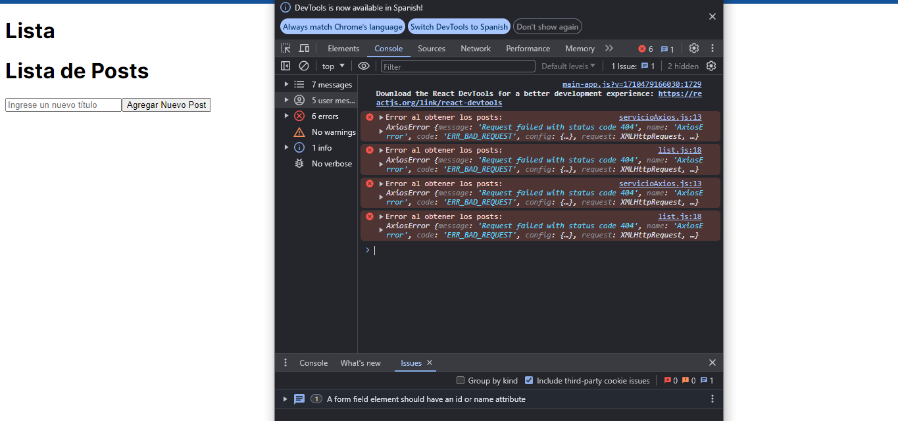

This is a [Next.js](https://nextjs.org/) project bootstrapped with [`create-next-app`](https://github.com/vercel/next.js/tree/canary/packages/create-next-app).

## Getting Started

First, run the development server:

```bash
npm run dev
# or
yarn dev
# or
pnpm dev
# or
bun dev
```

Open [http://localhost:3000](http://localhost:3000) with your browser to see the result.

You can start editing the page by modifying `app/page.js`. The page auto-updates as you edit the file.

This project uses [`next/font`](https://nextjs.org/docs/basic-features/font-optimization) to automatically optimize and load Inter, a custom Google Font.

## Learn More

To learn more about Next.js, take a look at the following resources:

- [Next.js Documentation](https://nextjs.org/docs) - learn about Next.js features and API.
- [Learn Next.js](https://nextjs.org/learn) - an interactive Next.js tutorial.

You can check out [the Next.js GitHub repository](https://github.com/vercel/next.js/) - your feedback and contributions are welcome!

## Deploy on Vercel

The easiest way to deploy your Next.js app is to use the [Vercel Platform](https://vercel.com/new?utm_medium=default-template&filter=next.js&utm_source=create-next-app&utm_campaign=create-next-app-readme) from the creators of Next.js.

Check out our [Next.js deployment documentation](https://nextjs.org/docs/deployment) for more details.


*****************************************************************************************************************
Este proyecto fue realizado con nextjs y axios para manejar una comunicacion Http a una api 
llamada JSONplaceholder una api publica con la cual uno pude practicar la realizacion de un crud

Dentro de la carpeta config se encuantra un archivo llamado axiosservicio,js donde se definen todas las funciones que se necesitan para la obtencion, creacion, actualizacion y elminacion de los datos con base en la documentacion de la Api y en el archivo list de la carpeta components se encontrara el llamado de estas funciones para relizar las acciones antes mencionadas y en el archivo page.js se encuentra la importacion de la vista que aparece en el archivo list.js. A cada una de las funciones se les implemento un try catch para que muestren un error en la consola en caso de que llegara a haberlo com en el siguiente caso suponiendo que al realizar la consulta get no defini bien la url en la vista se muestra vacia pero en la consola del navegador muestra que no se pueden obtener los datos 



